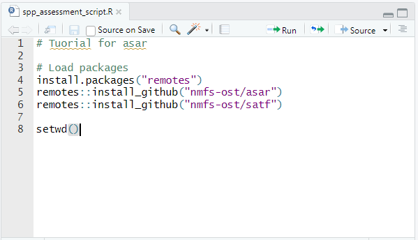
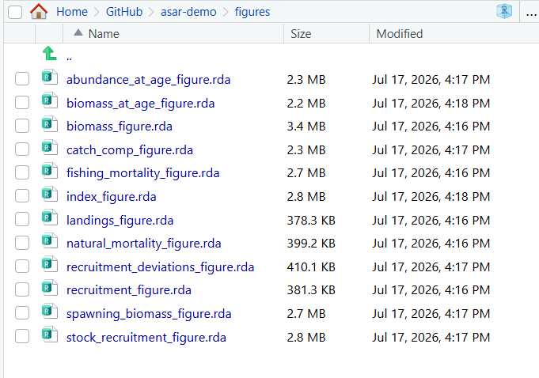
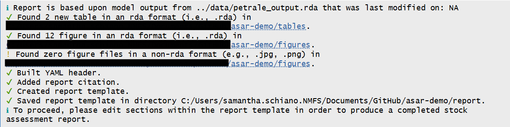
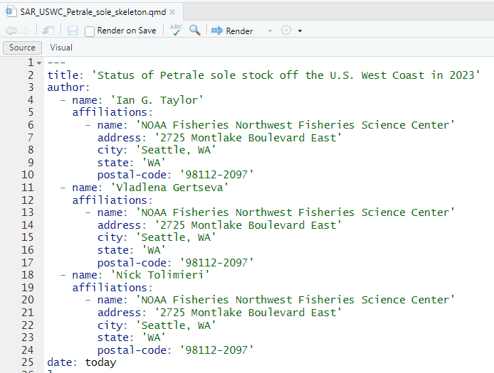
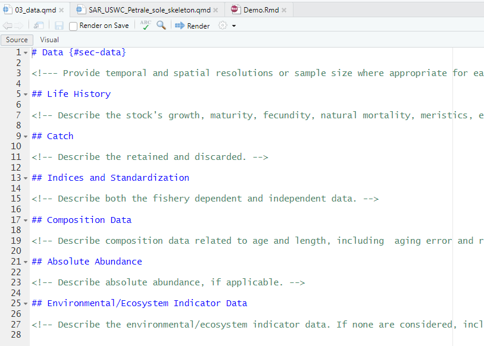
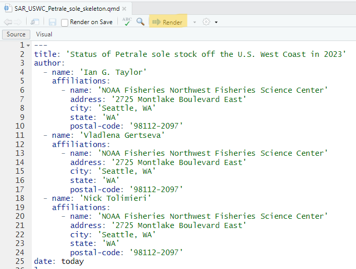

```{r setup, include=FALSE}
library(learnr)
```

```{r, include = FALSE, eval=FALSE}
knitr::opts_chunk$set(
  collapse = TRUE,
  comment = "#>"
)
```

```{r, echo=FALSE, eval=TRUE}
add_resource_path <- function(path) {
  if (dir.exists(path))
    shiny::addResourcePath(basename(path), path)
  if (dir.exists(path)) {
    prefix <- paste0("shiny_prerendered_", basename(path))
    shiny::addResourcePath(prefix, path)
  }
}
add_resource_path(getwd())
output_dir <- getwd()
add_resource_path(file.path(output_dir,"css"))
add_resource_path(file.path(output_dir,"images"))
```

## Welcome

The `asar` R package is a tool intended to improve and streamline the workflows of stock assessment scientists focusing on reporting. The following instructions will guide the user on how to efficiently use the tool. The other articles available on this website will provide descriptions of other tools that will help a user implement this package into their workflow.

This tutorial is an extension of the example presented during the [Stock Assessment Workflows Workshop Series](https://nmfs-ost.github.io/workflows-workshop/).

### Directions

For most navigation, click the 'Next Topic' button at the bottom of the page or select a topic from the navigation bar on the left hand side of the screen. Make sure to hit the 'Next Topic' button after each part.

In some cases, set of tabs is located on a page in which you will still need to hit the 'Next Topic' button to see the other tabs. We will hopefully fix this issue in the future.

## Recorded Demo

Below is a shortened demonstration of some of the content in this tutorial. Please note that this demo was recorded in October 2024, before the tool's first release in January 2025. If you encounter issues with your code, double-check with the package's documentation, which will be up-to-date.

<iframe width="640" height="360" src="https://youtube.com/embed/Q8XJTTkjcts?autoplay&amp;end=1577&amp;start=1200 " frameborder="0" allowfullscreen>

</iframe>

A more updated video tutorial should be available in late 2026.

## Background

In this tutorial, you will be working to recreate the 2023 Petrale sole stock assessment report. Below are links to two useful folders:

1.  A folder containing [materials you might need, such as example data](https://github.com/nmfs-ost/asar-demo/tree/main/data).
2.  A folder containing [the files that should be produced if you recreate this example](https://github.com/nmfs-ost/asar-demo/tree/main/report).

### Species Background

Petrale sole is a right-eyed flounder ranging from the western Gulf of Alaska to the Coronado Islands in northern Baja California. It is often referred to as brill, California sole, Jordan's flounder, cape sole, and other additional common names. The stock has consistently been the most commercially valuable flatfish in the California Current Ecosystem and has been sought after since the late 19th century. This stock was last assessed in 2023 by NOAA Fisheries Northwest Fisheries Science Center. The following example will recreate the [stock assessment report](https://www.pcouncil.org/documents/2024/02/status-of-petrale-sole-eopsetta-jordanialong-the-u-s-west-coast-in-2023.pdf/) published by the Pacific Fisheries Management Council (PFMC). [Additional assessments from the PFMC can be found here](https://www.pcouncil.org/stock-assessments-star-reports-stat-reports-rebuilding-analyses-terms-of-reference/groundfish-stock-assessment-documents/).

## Prerequisites

To begin, please download the following packages:

``` r
install.packages("remotes")
remotes::install_github("nmfs-ost/asar")
remotes::install_github("nmfs-ost/stockplotr")
```

Also ensure that [Quarto](https://quarto.org/docs/download/index.html) is installed.

Please reference the [README](https://github.com/nmfs-ost/asar) if you are having issues downloading the package.

## Set Working Directory

Please set your working directory to the folder that should contain the files created from this package. The `create_template` function in `asar` will create a standard folder named "report" to store all of the files, but you as the user need to identify where they should be placed.

Three ways to set the working directory are to [make an R project](https://r4ds.hadley.nz/workflow-scripts.html#rstudio-projects), use the [`here` package](https://here.r-lib.org/) (see the [Relative Paths](#relative-paths) section, below), and/or use [`setwd()`](https://www.rdocumentation.org/packages/base/versions/3.6.2/topics/getwd).

Tip: If a working directory is not set manually, the function will default to the default working directory in R found in Tools \> Global Options \> General.

## Create Blank R script

In this script, you will execute the primary functions of this package and create a template for a stock assessment report. It can be helpful to save this script for later use or future assessments.



## Relative Paths {#relative-paths}

It is recommended to use a method to create relative paths to files such as the [`here` package](https://here.r-lib.org/). The `here` function creates a file that allows R to create a path to a folder without having the user manually write out the path. The way to use this is to download the package, then run the function `here` **after** setting the working directory.

``` r
install.packages("here")
here::here()
```

The user can now designate paths within the folder containing the 'here' file. Note: the file will be hidden within the Rstudio interface, but can be seen in File explorer or an equivalent local file location.

## Locate Model Output File

For this step, we recommend either placing the model results file for either Stock Synthesis (SS3) or Beaufort Assessment Model (BAM) into your working directory. The model results files are the Report.sso file (SS3) or the .rdat file produced after running the ADMB2R routines (BAM).

You can download the petrale sole output file [here](https://github.com/nmfs-ost/asar-demo/blob/main/data/Report.sso).

**Example:** The following example will load the Report.sso file from your working directory using the `here` function.

``` r
output_file <- here::here("data","Report.sso")
```

## Preparing to Run `create_template` {.tabset}

### Convert to Standard Output

`stockplotr` contains a function called `convert_output` that converts the model results file into a standardized data frame so it can be used to create tables and figures from the package. This function is designed to work with either SS3, BAM, FIMS, or Rceattle model results files. Run the following code to both add the output into your environment and save the file into your folder.

``` r
petrale_conout <- stockplotr::convert_output(
  file = output_file,
  model = "SS3", # optional, function recognizes model
  save_dir = here::here("data","petrale_output.rda")
)
```

All 'stockplotr' functions that use these model results require the results to be loaded into the environment.


### Prepare Tables and Figures

Figures and tables are created with the [`stockplotr`](https://github.com/nmfs-ost/stockplotr) package, which was designed to work in conjunction with `asar` to increase the automation of stock assessment reports. The input for `stockplotr` is a standardized framework of data produced from `convert_output` (i.e., a "converted" model results file). The output is a collection of pre-coded tables (made with [`gt`](https://github.com/rstudio/gt)) and figures (made with [`ggplot2`](https://github.com/tidyverse/ggplot2)). Both of these packages can operate independently as desired.

To export all available tables and figures from `stockplotr` run the following:

``` r
# Read in converted output file
load(here::here("data", "petrale_output.rda"))
# Run function
stockplotr::save_all_plots(dat = out_new)
```

*Note:* The dat file in the above function must be the converted dataframe from the `convert_output` function ran earlier in this tutorial. If you want increased customization for these tables/figures, we encourage you to run various functions in `stockplotr` individually. *This step can be done at any point in the workflow!*

You should have created two folders: (1) named "figures" that contains rda files of figures with their associated caption and alternative text and (2) named "tables" that contains rda files of tables with their associated caption and a latex version of the table (all pre-built for you!). You must check that the captions and alternative text are complete and accurate, then update them yourself if needed. See the [accessibility-related vignette](https://nmfs-ost.github.io/asar/articles/accessibility_guide.html) for guidance.



## Run `create_template`

Define your arguments for creating a stock assessment report template. Running the function without any arguments (e.g., `asar::create_template()`) will produce a blank report; however, you will need to be familiar enough with Quarto to make edits for a completed report. You can find more information on these objects in the [`stockplotr` package](https://github.com/nmfs-ost/stockplotr).

Recommended minimum arguments:

-   office
-   region (if applicable)
-   species
-   spp_latin
-   year (if different than the current year)
-   author(s)

``` r
asar::create_template(
  format = "pdf",
  office = "NWFSC",
  region = "U.S. West Coast",
  species = "Petrale sole",
  spp_latin = "Eopsetta jordani",
  year = 2023,
  author = c("Ian G. Taylor"="NWFSC", "Vladlena Gertseva"="NWFSC", "Nick Tolimieri"="NWFSC"),
  param_names = c("nf","sf"),
  param_values = c("North fleet", "South fleet"),
  model_results = "../data/petrale_output.rda" # converted model output
)
```

You will notice a series of messages in your console informing you of the progress of `create_template()`. The messages inform you that:

* The figures and tables Quarto documents were pre-filled with the figures and tables you made in the previous steps.
* The "skeleton" file was built including its components
* The location of your report folder and its contents



## `Create_template` Customizations {.tabset}

There are a variety of ways to customize the default template that allows the analyst to expand or change their report as needed.

### Affiliation Formatting

The `author` argument in `create_template` dictates the affiliation of each author. You should set a list of authors with corresponding affiliation acronyms such as "John Doe" = "NWFSC-SWA". In this example, John Doe is affiliated with NOAA Fisheries **N**orth**w**est **F**isheries **S**cience **C**enter, **S**eattle, **Wa**shington office (NWFSC-SWA). We have some non-NOAA collaborator affiliations in our database, but it is difficult to know the extent nationwide. In response, if there is no affiliation associated with an author, the template will fill out a placehholder that you will need to fill it. We have created an [issue template](https://github.com/nmfs-ost/asar/issues) for requested affiliations to be added to our database.

Note: Any author can be added into a report, but in some cases their affiliation may be missing in our database. In this case, you can [submit an issue here](https://github.com/nmfs-ost/asar/issues/19) and you will be added as soon as possible.

### Parameterization

The skeleton is by default parameterized to allow the user to reference commonly used terms or quantities. The default parameters are species, office, and region (if applicable).

The argument `custom_params` in the function allow the user to add more parameters by using a named vector `c("short_form" = "long_form")`.

To use these parameters, use the following notation while writing text:

```         
'r species`
```

### Section Customizations

By default, the template from `asar` includes the recommended standard guidelines for a NOAA stock assessment as agreed upon by a Steering Committee of NOAA assessment scientists. Details about what to include within each section/subsection are located in the default templates using an HTML comment. This means that the text will not be rendered with the rest of the document. Users can remove this text when writing the document if they wish.

`asar` offers a variety of customization features by using the argument `custom = TRUE`. These customizations can include the option to select a subset of sections using the argument `custom_sections` and/or add a new sections within the default (or custom selection) using the arguments `new_section` and `section_location`.

For example, if the user only wants to write a stock assessment report update that contains new data and the results.

Here is an application for customizing a template:

```{r echo=TRUE, eval=FALSE}
asar::create_template(
  format = "pdf",
  office = "NWFSC",
  region = "U.S. West Coast",
  species = "Petrale sole",
  spp_latin = "Eopsetta jordani",
  year = 2023,
  author = c("Ian G. Taylor"="NWFSC", "Vladlena Gertseva"="NWFSC", "Nick Tolimieri"="NWFSC"),
  custom_params = c("nf" = "North Fleet","sf" = "South Fleet"),
  model_results = "../data/petrale_output.rda",
  custom = TRUE,
  custom_sections = c("data", "assessment", "discussion"),
  new_section = "Harvest Control Rules",
  section_location = "after-assessment"
)
```

## What to Expect {.tabset}

### Skeleton

During processing, you will see progress for the template being built in the R console. A few messages are displayed that let's you know: if any tables or figures were added to the document, where the template was saved, and directions to fill out the template.

`asar` is only a partially automated tool that still requires the analyst to complete the bulk of the content in the report. Future releases will allow the user to call on old assessments that were made using a separate function, so only minor adjustments will be made as needed to the next assessment.

### Sections

There will be a series of Quarto (.qmd) files along with some others generated with the folder. The user will not need to modify the 'skeleton.qmd', but all other Quarto files will need to be filled in.



Each section Quarto file contains pre-built heading tags and subsections with details indicating what the user should touch on for each section.



The optional addition of new sections as indicated by the user in the `create_template` function will be blank with the exception of a pre-built header with the new section name.

-   Indicate the new section name (more than one section can be added using `c()`)
-   Indicate the placement of the section relative to the base sections (cases with more than one new sections added relative to another section will be added in the order listed)

``` r
new_section = "Management"
section_location = "before-discussion"
```

For more information on markdown notation and how to efficiently write a report in Quarto, see our [markdown help page](https://nmfs-ost.github.io/asar/articles/markdown_notation.html)!

## Figure and Table Chunks

The pre-made tables and figures are generated through the use of a separate package called `stockplotr`. By separating these two functions, it allows you to evaluate results files quickly without also generating the report. However, these two packages were co-developed to seamlessly integrate with one another and streamline the stock assessment workflow.

Your tables and figures quarto files **do not** come pre-filled. This allows for the process to be flexible and update the documents throughout the process. In order to set-up the tables and figures files automatically, you will need to run the `create_figures_doc()` and `create_tables_doc()` functions. If a figures or tables folder was present before running `create_template()` then, your figures and tables documents should be pre-filled with these objects.

If you create figures and tables **after** creating your template, run the following:

```r
asar::create_tables_doc(
  subdir = here::here("report"),
  tables_dir = here::here("report", "tables"),
)
asar::create_figures_doc(
  subdir = here::here("report"),
  figures_dir = here::here("report", "figures"),
)
```

*Note:* The `create_figures_doc()` function is able to format and load rda, png, or jpg images located within your figures folder.

Here is an example of how the tables and figures get set up in the file:

For each object (table or figure), there will be two chunks to properly call and create the object. The first loads in the rda object for the table or figure and calls in the list within the loaded rda into separate objects.

``` r
#| label: 'fig-abundance_at_age-setup'
#| warnings: false 
#| eval: true
# load rda
load(file.path(figures_dir, 'abundance_at_age_figure.rda'))

# save rda with plot-specific name
abundance_at_age_plot_rda <- rda

# remove generic rda object
rm(rda)

# save figure, caption, and alt text as separate objects
abundance_at_age_plot <- abundance_at_age_plot_rda$figure
abundance_at_age_cap <- abundance_at_age_plot_rda$caption
abundance_at_age_alt_text <- abundance_at_age_plot_rda$alt_text
```

``` r
#| label: 'fig-abundance_at_age'
#| echo: false 
#| warning: false 
#| fig-cap: !expr abundance_at_age_cap 
#| fig-alt: !expr abundance_at_age_alt_text
abundance_at_age_plot
```
### Flexible Design

The figures and tables are designed to be customizable to the user by applying the same notation as one would when creating a `gt` or `ggplot2` object. For example, in `ggplot2`, when adding a new theme, you would add it on using a "+" to the ggplot object following with the theme code. The same applied to plots made from `stockplotr`:

``` r
abundance_at_age_plot +
  ggplot2::theme_classic()
```

For any premade table, you can add onto the object using the native pipe operator and other `gt` functions. For example, we can add an additional row of headers using the following notation:

``` r
gt_obj <- gt::gt(data) |> 
  gt::fmt_scientific()

```

You can also adjust figure captions and alternative text from the arguments `fig-cap` and `fig-alt`. These two areas contain pre-generated generic text that applies to the table/figure. **Always check that a figure's alt text is accurate and complete.** To edit, simply make changes to the sentence(s) between the quotation marks. Visit the [accessibility-related vignette](https://nmfs-ost.github.io/asar/articles/accessibility_guide.html) for more guidance.

As of earlier this year, Quarto has made the `fig-alt` option inside of Quarto chunks functional for rendering to a PDF. If you are including any non-stockplotr figures, please use `fig-alt` to incorporate your own alternative text. (Reminder: alternative text is required to make a document 508 compliant).

## Rendering

After filling out all sections (and leaving ones that are not applicable with a blanket statement), it is time to produce the pdf report. User should click the 'render' button at the top of the script when using R studio or run the following code in the **terminal**:

``` r
quarto render SAR_USWC_Petrale_sole_skeleton.qmd
```



## Accessibility

The last step of any workflow should be making your document accessible (passing 508 compliance). We have been able to make stock assessment reports made in `asar` fully compliant with U.S. accessibility standards through the use of a single function, `add_accessibility()`.

There are 2 pre-requisites to run this function properly:

(1) You have a full install of `tinytex`. The bundle allows you to install of the necessary packages for producing an accessible report.
```r
install.packages("tinytex")
tinytex::install_tinytex(bundle = "TinyTeX-2")
```

(2) Set up a .csv spreadsheet containing alternative text for all figures if not using `stockplotr` to produce your figures and tables. The format of the csv file is as follows:

| label | type | caption | alt_text |
|-------|------|---------|----------|
| label found in the R chunk in your document; not including fig-/tab- | figure or table | (not required) caption for the figure/table | alternative text for the figure |

Once both of these steps are followed, run:

```r
asar::add_accessibility("sar_USWC_Petrale_sole_skeleton.tex")
```

*Notice you are running the function on the latex file of the document and not the Quarto skeleton or the pdf. This is because add_accessibility is an underlying application of LaTeX. The .tex file will not be in your folder structure until after you render your quarto skeleton.*


## Tips

-   DO NOT make changes to the area between the three dashes in the Quarto skeleton file (`---`) unless you are very familiar with Quarto. This area controls all of the formatting and will be the most likely spot for causing the document to break when rendering. The best way to make edits in this section is to use the `rerender_skeleton` function which will allow you to easily make updates to the yaml without manually making the changes. To find more information about this functionality, [see here](https://nmfs-ost.github.io/workflows-workshop/Curriculum/Day_2/day_2.html#rerendering-report).

-   In the future, additional tables and figures will be available from the [`stockplotr`](https://github.com/nmfs-ost/stockplotr) R package. Users can add these in by clicking the drop down button that looks like a square with a c in it or manually write in

``` r
#| label: ''
#| echo: false
#| warning: false
#| eval: true 
#| fig-cap: "Insert figure/table caption"
#| fig-alt: "Insert alternative text for figure/table"
stockplotr::plot_recruitment(dat = output)
```

-   `asar` is a continual work in progress. We are currently in version 2.4.0 of `asar` with continuous progress planned throughout 2027. Please leave an [issue](https://github.com/nmfs-ost/asar/issues) for any bugs you may run into.

-   Check out our [Frequently Asked Questions (FAQ) page](https://nmfs-ost.github.io/asar/articles/faqs.html) for more guidance using `asar`.

-   Our [closed issues](https://github.com/nmfs-ost/asar/issues?q=is%3Aissue+is%3Aclosed) are another great resource that could provide the answer to a potential question that you might have. These issues will be solved and should provide you a good direction to move in if encountering an issue.
