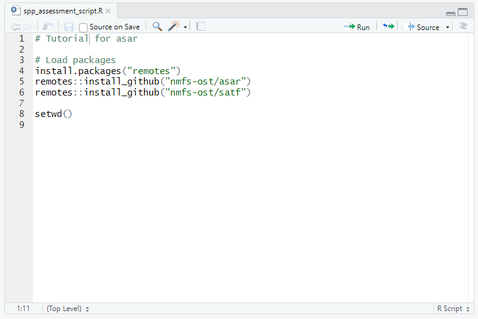
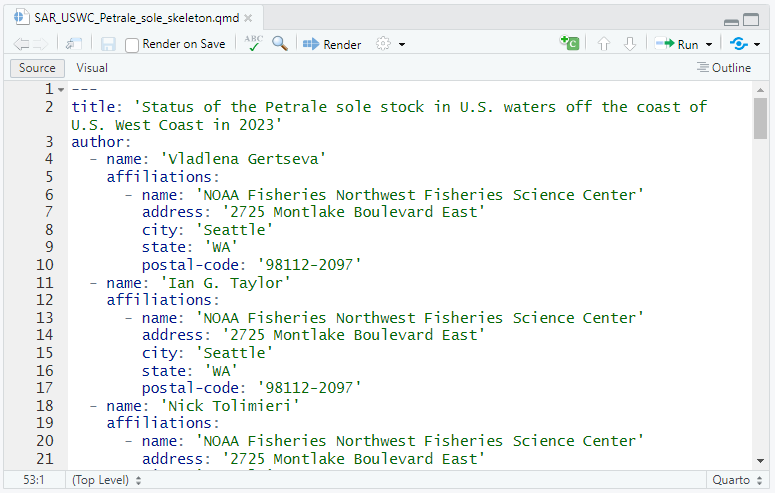

```{r setup, include=FALSE}
library(learnr)
```

```{r, include = FALSE, eval=FALSE}
knitr::opts_chunk$set(
  collapse = TRUE,
  comment = "#>"
)
```

```{r, echo=FALSE, eval=TRUE}
add_resource_path <- function(path) {
  if (dir.exists(path))
    shiny::addResourcePath(basename(path), path)
  if (dir.exists(path)) {
    prefix <- paste0("shiny_prerendered_", basename(path))
    shiny::addResourcePath(prefix, path)
  }
}
add_resource_path(getwd())
output_dir <- getwd()
add_resource_path(file.path(output_dir,"css"))
add_resource_path(file.path(output_dir,"images"))
```

## Welcome

The `asar` R package is a tool intended to improve and streamline the workflows of stock assessment scientists focusing on reporting. The following instructions will guide the user on how to efficiently use the tool. The other articles available on this website will provide descriptions of other tools that will help a user implement this package into their workflow.

This tutorial is an extension of the example presented on the [home page](https://nmfs-ost.github.io/asar/).

### Directions

For most navigation, click the 'Next Topic' button at the bottom of the page or select a topic from the navigation bar on the left hand side of the screen. Make sure to hit the 'Next Topic' button after each part.

In some cases, set of tabs is located on a page in which you will still need to hit the 'Next Topic' button to see the other tabs. We will hopefully fix this issue in the future.

## Recorded Demo

Below is a shortened demonstration of some of the content in this tutorial. Please note that this demo was recorded in October 2024, before the tool's first release in January 2025. If you encounter issues with your code, double-check with the package's documentation, which will be up-to-date.

<iframe width="640" height="360" src="https://youtube.com/embed/Q8XJTTkjcts?autoplay&amp;end=1577&amp;start=1200 " frameborder="0" allowfullscreen>

</iframe>

## Background

In this tutorial, you will be working to recreate the 2023 Petrale sole stock assessment report. Below are links to two useful folders:

1.  A folder containing [materials you might need, such as example data](https://github.com/nmfs-ost/asar-demo/tree/main/data).
2.  A folder containing [the files that should be produced if you recreate this example](https://github.com/nmfs-ost/asar-demo/tree/main/report).

### Species Background

Petrale sole is a right-eyed flounder ranging from the western Gulf of Alaska to the Coronado Islands in northern Baja California. It is often referred to as brill, California sole, Jordan's flounder, cape sole, and other additional common names. The stock has consistently been the most commercially valuable flatfish in the California Current Ecosystem and has been sought after since the late 19th century. This stock was last assessed in 2023 by NOAA Fisheries Northwest Fisheries Science Center. The following example will recreate the [stock assessment report](https://www.pcouncil.org/documents/2024/02/status-of-petrale-sole-eopsetta-jordanialong-the-u-s-west-coast-in-2023.pdf/) published by the Pacific Fisheries Management Council (PFMC). [Additional assessments from the PFMC can be found here](https://www.pcouncil.org/stock-assessments-star-reports-stat-reports-rebuilding-analyses-terms-of-reference/groundfish-stock-assessment-documents/).

## Prerequisites

To begin, please download the following packages:

``` r
install.packages("remotes")
remotes::install_github("nmfs-ost/asar")
remotes::install_github("nmfs-ost/stockplotr")
```

Also ensure that [Quarto](https://quarto.org/docs/download/index.html) is installed.

Please reference the [README](https://github.com/nmfs-ost/asar) if you are having issues downloading the package.

## Set Working Directory

Please set your working directory to the folder that should contain the files created from this package. The `create_template` function in `asar` will create a standard folder named "report" to store all of the files, but you as the user need to identify where they should be placed.

Three ways to set the working directory are to [make an R project](https://r4ds.hadley.nz/workflow-scripts.html#rstudio-projects), use the [`here` package](https://here.r-lib.org/) (see the [Relative Paths](#relative-paths) section, below), and/or use [`setwd()`](https://www.rdocumentation.org/packages/base/versions/3.6.2/topics/getwd).

Tip: If a working directory is not set manually, the function will default to the default working directory in R found in Tools \> Global Options \> General.

## Create Blank R script

In this script, you will execute the primary functions of this package and create a template for a stock assessment report. It can be helpful to save this script for later use or future assessments.



## Relative Paths {#relative-paths}

It is recommended to use a method to create relative paths to files such as the [`here` package](https://here.r-lib.org/). The `here` function creates a file that allows R to create a path to a folder without having the user manually write out the path. The way to use this is to download the package, then run the function `here` **after** setting the working directory.

``` r
install.packages("here")
here::here()
```

The user can now designate paths within the folder containing the 'here' file. Note: the file will be hidden within the Rstudio interface, but can be seen in File explorer or an equivalent local file location.

## Locate Model Output File

For this step, we recommend either placing the model results file for either Stock Synthesis (SS3) or Beaufort Assessment Model (BAM) into your working directory. The model results files are the Report.sso file (SS3) or the .rdat file produced after running the ADMB2R routines (BAM).

You can download the petrale sole output file [here](https://github.com/nmfs-ost/asar-demo/blob/main/data/Report.sso).

**Example:** The following example will load the Report.sso file from your working directory using the `here` function.

``` r
output_file <- here::here("Report.sso")
```

## Preparing to Run `create_template` {.tabset}

### Convert to Standard Output

We recommend converting your output file outside of the `create_template` function for large and/or complex data sets. There are two options for running this function.

1)  (Recommended) Save the converted model results as a .csv

``` r
asar::convert_output(
  output_file = output_file,
  outdir = here::here(), # or wherever you saved the example output file
  model = "SS3",
  file_save = TRUE,
  savedir = here::here(),
  save_name = "petrale_sole_std_output"
)
```

2)  Convert model results and save as an object in your R environment

``` r
output <- asar::convert_output(
  output_file = "Report.sso",
  outdir = getwd(),
  model = "SS3"
)
```

### Prepare Tables and Figures

Figures and tables are created with the [`stockplotr`](https://github.com/nmfs-ost/stockplotr) package, which was designed to work in conjunction with `asar` to increase the automation of stock assessment reports. The input for `stockplotr` is a standardized framework of data produced from the `asar` function `convert_output` (i.e., a "converted" model results file). The output is a collection of pre-coded tables (made with [`flextable`](https://github.com/davidgohel/flextable)) and figures (made with [`ggplot2`](https://github.com/tidyverse/ggplot2)). Both of these packages can operate independently as desired.

The user has two options to create tables and figures with `stockplotr`:

(1) Create all figures and tables with `stockplotr`, then run `asar`. To do this, run the following code BEFORE running `asar::create_template`:

``` r
# Read in converted output file
output <- utils::read.csv(here::here("petrale_sole_std_output.csv"))
# Run function
stockplotr::exp_all_figs_tables(
  dat = output,
  end_year = 2022,
  rda_dir = here::here(),
  ref_line = "msy",
  ref_line_sb = "msy",
  indices_unit_label = "CPUE")
```

*Note:* The dat file in the above function should be the converted dataframe from the `convert_output` function ran earlier in this tutorial. If you want increased customization for these tables/figures, we encourage you to run various functions in `stockplotr` individually.

(2) To create figures and tables *and* the report template in the same step, set specific arguments in `asar::create_template` to run everything together. The arguments are as follows:

-   rda_dir (required)

Optional:

-   recruitment_unit_label

-   end_year

-   ref_line

-   ref_line_sb

-   landings_unit_label

-   spawning_biomass_label

-   ref_point

-   ref_point_sb

-   indices_unit_label

-   biomass_unit_label

-   catch_unit_label

After selecting one of the two above options, you should have created a folder that contains rda files of tables and figures with their associated caption and alternative text (all pre-built for you!). You must check that the captions and alternative text are complete and accurate, then update them yourself if needed. See the [accessibility-related vignette](https://nmfs-ost.github.io/asar/articles/accessibility_guide.html) for guidance.


## Run `create_template`

Define your arguments for creating a stock assessment report template. Running the function without any arguments (e.g., `asar::create_template()`) will produce a blank report; however, you will need to be familiar enough with Quarto to make edits for a completed report. Running a blank template will also not include any pre-coded tables or figures in the folder. You can find more information on these objects in the [`stockplotr` package](https://github.com/nmfs-ost/stockplotr).

Recommended minimum arguments:

-   office
-   region (if applicable)
-   species
-   spp_latin
-   year (if different than the current year)
-   author(s)

``` r
asar::create_template(
  format = "pdf",
  office = "NWFSC",
  region = "U.S. West Coast",
  species = "Petrale sole",
  spp_latin = "Eopsetta jordani",
  year = 2023,
  author = c("Ian G. Taylor", "Vladlena Gertseva", "Nick Tolimieri"),
  include_affiliation = TRUE,
  simple_affiliation = FALSE,
  param_names = c("nf","sf"),
  param_values = c("North fleet", "South fleet"),
  resdir = here::here(), # indicate where the model output is located
  model_results = "petrale_sole_std_output.csv", # converted model output
  rda_dir = here::here() # directory where the rda files were made in previous step
)
```

## `Create_template` Customizations {.tabset}

There are a variety of ways to customize the default template that allows the analyst to expand or change their report as needed.

### Affiliation Formatting

The user has the option to select multiple ways to report affiliations of assessment authors. The default is a "simple" affiliation which only cites the institution that the author(s) is associated with negating the address afterwards. All other affiliations will include each author's institution name and address.

``` r
author:
  - name: 'Ian G. Taylor'
    affiliations:
      - name: 'NOAA Fisheries Northwest Fisheries Science Center'
        address: '2725 Montlake Boulevard East'
        city: 'Seattle'
        state: 'WA'
        postal-code: '98112-2097'
```

The option to remove affiliation altogether is present by setting `include_affiliation = FALSE`.

Note: While we have made efforts to create an extensive list of assessment authors across NOAA, there may be instances where you or a colleague does not have their associated affiliation since they are not in our database. In this case, you can [submit an issue here](https://github.com/nmfs-ost/asar/issues/19) and you will be added as soon as possible.

*In the meantime, another author can be added using the argument `add_author`. Their affiliation can be manually added after creating the template following the same formatting in the YAML as the other authors.*

### Parameterization

The skeleton is by default parameterized to allow the user to reference commonly used terms or quantities. The default parameters are species, office, and region (if applicable).

Two arguments in the function allow the user to add more parameters: - `param_names` - `param_values`

To use these parameters, use the following notation while writing text:

```         
'r params$species`
```

Additional parameters can be added using the arguments:

-   `param_names`
-   `param_values`

For including more than one new parameter please list them using `c()`. For example:

``` r
param_names = c("fleet1", "fleet2", )
param_values = c("recreational", "commercial")
```

### Section Customizations

By default, the template from `asar` includes the recommended standard guidelines for a NOAA stock assessment as agreed upon by a Steering Committee of NOAA assessment scientists. Details about what to include within each section/subsection are located in the default templates using an HTML comment. This means that the text will not be rendered with the rest of the document. Users can remove this text when writing the document if they wish.

`asar` offers a variety of customization features by using the argument `custom=TRUE`. These customizations can include the option to select a subset of sections using the argument `custom_sections` or add a new sections within the default (or custom selection) using the arguments `new_section` and `section_location`.

For example, if the user only wants to write a stock assessment report update that contains new data and the results.

Here is an application for customizing a template:

```{r echo=TRUE, eval=FALSE}
asar::create_template(
  format = "pdf",
  office = "NWFSC",
  region = "U.S. West Coast",
  species = "Petrale sole",
  spp_latin = "Eopsetta jordani",
  year = 2023,
  author = c("Ian G. Taylor", "Vladlena Gertseva", "Nick Tolimieri"),
  include_affiliation = TRUE,
  simple_affiliation = FALSE,
  param_names = c("nf","sf"),
  param_values = c("North fleet", "South fleet"),
  resdir = here::here(),
  model_results = "petrale_sole_std_output.csv",
  custom = TRUE,
  custom_sections = c("data", "assessment", "discussion"),
  new_section = "Harvest Control Rules",
  section_location = "after-assessment"
)
```

## What to Expect {.tabset}

### Skeleton

During processing, you will see progress for the template being built in the R console. A message is displayed that let's you know where the template was saved and to fill out the template.

`asar` is only a partially automated tool that still requires the analyst to complete the bulk of the content in the report. Future releases will allow the user to call on old assessments that were made using `asar::create_template(new_template=FALSE)`, so only minor adjustments will be made as needed to the current assessment.

### Sections

There will be a series of Quarto (.qmd) files along with some others generated with the folder. The user will not need to modify the 'skeleton.qmd', but all other Quarto files will need to be filled in.



Each section Quarto file contains pre-built heading tags and subsections with details indicating what the user should touch on for each section.


The optional addition of new sections as indicated by the user in the `create_template` function will be blank with the exception of a pre-built header with the new section name.

-   Indicate the new section name (more than one section can be added using `c()`)
-   Indicate the placement of the section relative to the base sections (cases with more than one new sections added relative to another section will be added in the order listed)

``` r
new_section = "Management"
section_location = "before-discussion"
```

For more information on markdown notation and how to efficiently write a report in Quarto, see our [markdown help page](https://nmfs-ost.github.io/asar/articles/markdown_notation.html)!

## Figure and Table Chunks

The pre-made tables and figures are generated through the use of a separate package called `stockplotr`. By separating these two functions, it allows you to evaluate results files quickly without also generating the report. However, these two packages were co-developed to seamlessly integrate with one another and streamline the stock assessment workflow.

In the `08_tables.qmd` and `09_figures.qmd` Quarto files located in your folder, there will be a series of pre-made tables and figures that includes pre-written generic captions and alternative text. You are able to include or not include these objects at will. We recommend to include all default objects, but if a table or figure doesn't apply, you are able to prevent the object from being added to the report by changing the option of **eval** to false.

Here is an example:

For each object (table or figure), there will be two chunks to properly call and create the object. The first loads in the rda object for the table or figure and calls in the list within the loaded rda into separate objects.

``` r
#| label: 'fig-recruitment-setup'
#| echo: false 
#| warning: false 
#| eval: true 
# if the recruitment figure rda exists:
if (file.exists(file.path(rda_dir, 'recruitment_figure.rda'))){

  # load rda
  load(file.path(rda_dir, 'recruitment_figure.rda'))

  # save rda with plot-specific name
  recruitment_plot_rda <- rda

  # remove generic rda object
  rm(rda)

  # save figure, caption, and alt text as separate objects; set eval to TRUE
  recruitment_plot <- recruitment_plot_rda$figure
  recruitment_cap <- recruitment_plot_rda$cap
  recruitment_alt_text <- recruitment_plot_rda$alt_text
  eval_recruitment <- TRUE

# if the recruitment figure rda does not exist, don't evaluate the next chunk
} else {eval_recruitment <- FALSE}
```

``` r
#| label: 'fig-recruitment-plot'
#| echo: false 
#| warning: false 
#| eval: !expr eval_recruitment 
#| fig-cap: !expr if(eval_recruitment) recruitment_cap 
#| fig-alt: !expr if(eval_recruitment) recruitment_alt_text
recruitment_plot
```

The figures and tables are designed to be adjustable to the user by applying the same notation as one would when creating a `flextable` or `ggplot2` object. For example, in `ggplot2`, when adding a new theme, you would add it on using a "+" to the ggplot object following with the theme code:

``` r
gg_obj <- ggplot(data, aes(x,y)) +
geom_line()

gg_obj + theme()
```

For any premade table, you can add onto the object using the native pipe operator and other `flextable` functions. For example, we can add an additional row of headers using the following notation:

``` r
flex_obj <- flextable(data) |> bold(part = "header")

flex_obj |> add_header()
```

You can also adjust figure captions and alternative text from the arguments `fig-cap` and `fig-alt`. These two areas contain pre-generated generic text that applies to the table/figure. **Always check that a figure's alt text is accurate and complete.** To edit, simply make changes to the sentence(s) between the quotation marks. Visit the [accessibility-related vignette](https://nmfs-ost.github.io/asar/articles/accessibility_guide.html) for more guidance.

Currently, Quarto does not include features for alternative text in PDFs, but the developers of `asar` are working on a way to get around this issue.

## Rendering

After filling out all sections (and leaving ones that are not applicable with a blanket statement), it is time to produce the pdf report. User should click the 'render' button at the top of the script when using R studio or run the following code in the **terminal**:

``` r
quarto render SAR_USWC_Petrale_sole_skeleton.qmd
```


## Tips

-   DO NOT make changes to the area between the three dashes in the Quarto skeleton file (`---`) unless you are very familiar with Quarto. This area controls all of the formatting and will be the most likely spot for causing the document to break when rendering.

-   In the future, additional tables and figures will be available from the [`stockplotr`](https://github.com/nmfs-ost/stockplotr) R package. Users can add these in by clicking the drop down button that looks like a square with a c in it or manually write in

``` r
#| label: ''
#| echo: false
#| warning: false
#| eval: true 
#| fig-cap: "Insert figure/table caption"
#| fig-alt: "Insert alternative text for figure/table"
stockplotr::plot_recruitment(dat = output)
```

-   `asar` is a continual work in progress. We are currently in version 1.2 of `asar` with continuous progress planned for 2025. Please leave an [issue](https://github.com/nmfs-ost/asar/issues) for any bugs you may run into.

-   Check out our [Frequently Asked Questions (FAQ) page](https://nmfs-ost.github.io/asar/articles/faqs.html) for more guidance using `asar`.

-   Our [closed issues](https://github.com/nmfs-ost/asar/issues?q=is%3Aissue+is%3Aclosed) are another great resource that could provide the answer to a potential question that you might have. These issues will be solved and should provide you a good direction to move in if encountering an issue.
